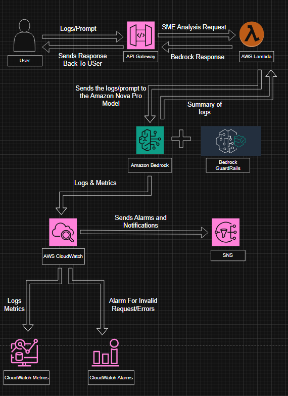

#  SME Assistant — AI-Powered Log Analysis on AWS

> A serverless Subject Matter Expert assistant that analyzes application logs using **Amazon Bedrock Nova Pro**, with built-in **Guardrails**, real-time **CloudWatch** observability, and **SNS** alerting.

---

##  Overview

SME Assistant is a production-ready AWS-native log intelligence system. Users submit raw equipment logs or sensor data via a **Streamlit web frontend**, which calls an API Gateway-backed Lambda function and returns a structured 5-line expert analysis using Amazon Bedrock's Nova Pro model — with safety guardrails enforced on every request.

**Domain:** Wind Turbine Manufacturing — Predictive Maintenance & Diagnostic Analysis

---

##  Architecture


<p align="center">
  
</p>


**Request Flow:**
1. User pastes equipment logs into the Streamlit UI and clicks **Run Diagnostic**
2. Streamlit sends HTTP POST to API Gateway endpoint
3. API Gateway triggers AWS Lambda (`sme_assistant.py`)
4. Lambda forwards the prompt to Amazon Bedrock Nova Pro (APAC region)
5. Bedrock Guardrails filter both input and output
6. Bedrock returns a 5-line expert analysis
7. Lambda sends the response back → API Gateway → Streamlit renders the result

**Observability Flow:**
- Lambda + Bedrock emit Logs & Metrics → CloudWatch
- CloudWatch Alarms trigger on errors/invalid requests → SNS notifications

---

##  AWS Services Used

| Service | Purpose |
|---|---|
| **Streamlit** | Web frontend — log input UI + results display |
| **API Gateway** | REST API endpoint for frontend requests |
| **AWS Lambda** | Serverless orchestration layer |
| **Amazon Bedrock (Nova Pro)** | LLM inference — log summarization |
| **Bedrock Guardrails** | Input/output safety filtering |
| **Amazon CloudWatch** | Logs, metrics, and alarms |
| **Amazon SNS** | Alarm notifications |

---

##  Bedrock Guardrails

Guardrails are applied on every `invoke_model` call via:
- `guardrailIdentifier` — unique guardrail ID
- `guardrailVersion` — versioned policy
- `trace='ENABLED'` — full audit trail in CloudWatch

Policies configured:
- **Content filters** — blocks harmful/irrelevant content
- **Denied topics** — restricts responses to wind turbine manufacturing domain only
- **Sensitive info redaction** — strips PII from inputs/outputs

---

##  Step-by-Step Deployment Guide

### Prerequisites

- AWS Account with appropriate IAM permissions
- AWS CLI configured (`aws configure`)
- Python 3.11+

---

### Step 1 — Choose Amazon Bedrock Model Access

1. Go to **AWS Console → Amazon Bedrock → Model Access**
2. Click **Manage model access**
3. Choose **Amazon Nova Pro**

---

### Step 2 — Create Bedrock Guardrail

1. Go to **AWS Console → Amazon Bedrock → Guardrails**
2. Click **Create guardrail**
3. Configure:
   - **Name:** `sme-assistant-guardrail`
   - **Content filters:** Enable and set strength to MEDIUM for hate, insults, violence
   - **Denied topics:** Add topic — *"Questions unrelated to wind turbine manufacturing or log analysis"*
   - **Sensitive information:** Enable PII redaction (NAME, EMAIL, PHONE)
4. Click **Create guardrail**
5. Note the **Guardrail ID** (e.g. `hmszjawjyp34`) and **Version** (`1`)

---

### Step 3 — Create IAM Role for Lambda

1. Go to **IAM → Roles → Create Role**
2. Select **AWS Service → Lambda**
3. Attach these policies:
   - `AmazonBedrockFullAccess`
   - `CloudWatchLogsFullAccess`
4. Name the role: `sme-assistant-lambda-role`
5. Click **Create role**

---

### Step 4 — Create Lambda Function

1. Go to **AWS Console → Lambda → Create function**
2. Select **Author from scratch**
3. Configure:
   - **Function name:** `sme-assistant`
   - **Runtime:** Python 3.11
   - **Execution role:** Use existing role → `sme-assistant-lambda-role`
4. Click **Create function**
5. In the **Code** tab, paste the contents of `sme_assistant.py`
6. Update `guardrailIdentifier` with your Guardrail ID from Step 2
7. Click **Deploy**

---

### Step 5 — Configure Lambda Settings

1. Go to **Configuration → General configuration**
2. Set **Timeout** to `30 seconds` (Bedrock calls can be slow)
3. Set **Memory** to `256 MB`
4. Save changes

---

### Step 6 — Create API Gateway

1. Go to **AWS Console → API Gateway → Create API**
2. Select **REST API → Build**
3. Configure:
   - **API name:** `sme-assistant-api`
   - **Endpoint type:** Regional
4. Click **Create API**
5. Create a resource:
   - Actions → **Create Resource** → Resource name: `analyze`
6. Create a method:
   - Select `/analyze` → Actions → **Create Method** → `POST`
   - Integration type: **Lambda Function**
   - Lambda function: `sme-assistant`
   - Click **Save** → OK (grant permission)
7. Deploy the API:
   - Actions → **Deploy API**
   - Stage: `[New Stage]` → Stage name: `prod`
8. Copy the **Invoke URL** shown after deployment

---

### Step 7 — Set Up CloudWatch Alarms

1. Go to **CloudWatch → Alarms → Create alarm**
2. Select metric: **Lambda → By Function Name → sme-assistant → Errors**
3. Configure:
   - **Threshold:** Greater than 0 for 1 datapoint
   - **Alarm name:** `sme-assistant-errors`
4. Add SNS notification action (see Step 8)
5. Repeat for `Throttles` metric

---

### Step 8 — Create SNS Topic for Alerts

1. Go to **SNS → Topics → Create topic**
2. Type: **Standard**
3. Name: `sme-assistant-alerts`
4. Click **Create topic**
5. Create a subscription:
   - Protocol: **Email**
   - Endpoint: your email address
6. Confirm the subscription via the email you receive
7. Go back to CloudWatch Alarm (Step 7) and attach this SNS topic

---

### Step 9 — Run the Streamlit Frontend

The frontend (`streamlit-app.py`) is a dark-themed web UI that connects directly to your deployed API Gateway endpoint.

**Setup on Windows (PowerShell):**

```powershell
# 1. Check Python and pip versions
python --version
pip --version

# 2. (Only if PowerShell blocks script activation)
Set-ExecutionPolicy -ExecutionPolicy RemoteSigned -Scope CurrentUser

# 3. Create and activate virtual environment
python -m venv venv
.\venv\Scripts\Activate.ps1

# 4. Install dependencies
pip install streamlit requests

# OR install via requirements.txt
pip install -r requirements.txt

# 5. Run the app
streamlit run streamlit-app.py
```

**Your `requirements.txt`:**
```
streamlit
requests
```

**Update the API endpoint** in `streamlit-app.py` before running:
```python
response = requests.post(
    "https://<your-api-id>.execute-api.ap-south-1.amazonaws.com/prod/sme_assistant",
    json={"prompt": prompt},
    timeout=30
)
```

The app opens at `http://localhost:8501` in your browser.

---

### Step 10 — Test the Full Flow

**Via Streamlit UI:**
1. Open `http://localhost:8501`
2. Paste equipment logs into the text area
3. Click **Run Diagnostic**
4. View the 5-line expert analysis in the output panel

---


